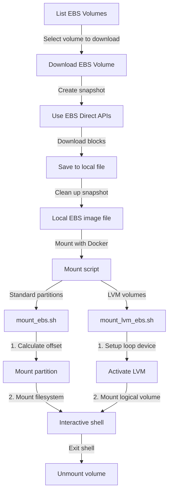

# EBS Volume Manager

I needed a script that lets me download AWS EC2 EBS volumes and mount them locally. I wrote this using Claude 3.7, so expect the code to look like it was written by Claude 3.7. 

## Rationale

AWS does not natively support downloading and mounting an EC2 EBS volume. This script does that for me so I don't have to do the intermediate steps

## How It Works

The following diagram illustrates the workflow of downloading and mounting an EBS volume:



The process involves:
1. Listing available EBS volumes in your AWS account
2. Creating a snapshot of the selected volume
3. Using EBS Direct APIs to download all blocks
4. Saving the data to a local file
5. Mounting the file using Docker with the appropriate script:
   - `mount_ebs.sh` for standard partitioned volumes
   - `mount_lvm_ebs.sh` for volumes using Logical Volume Management (LVM)

## Quickstart

```bash
# Install dependencies
uv venv
uv pip install -e .

# List your EBS volumes
python ebs_manager.py --list

# Download an EBS volume
python ebs_manager.py --download vol-1234567890abcdef0 -o my_volume

# Mount the downloaded volume (drops you directly into the mounted directory)
./mount_ebs.sh -i my_volume

# When done, type 'exit' or press Ctrl+D to unmount and exit
```

## Prerequisites

- Python 3.7+
- UV package manager
- AWS credentials configured
- Docker (for mounting volumes)

## Installation

1. Clone this repository
2. Create a virtual environment and install dependencies:
   ```bash
   # Create a virtual environment
   uv venv
   
   # Activate the virtual environment
   source .venv/bin/activate  # On Unix/macOS
   # or
   .venv\Scripts\activate     # On Windows
   
   # Install dependencies
   uv pip install -e .
   
   # For development dependencies
   uv pip install -e ".[dev]"
   ```
3. Make scripts executable: `chmod +x ebs_manager.py mount_ebs.sh mount_lvm_ebs.sh`

## Usage

### Listing EBS Volumes

```bash
python ebs_manager.py --list
python ebs_manager.py --list --region us-east-1
```

### Downloading an EBS Volume

```bash
python ebs_manager.py --download vol-1234567890abcdef0 -o output_file
python ebs_manager.py --download vol-1234567890abcdef0 -o output_file --region us-west-2 --force
```

### Mounting Downloaded Volumes

For standard partitioned volumes:

```bash
# Mount the first partition (default)
./mount_ebs.sh -i volume_file
# You'll be dropped directly into the mounted directory
# Type 'exit' or press Ctrl+D to unmount and exit

# Mount a specific partition
./mount_ebs.sh -i volume_file -p 2

# List partitions without mounting
./mount_ebs.sh -i volume_file -l
```

For LVM volumes:

```bash
./mount_lvm_ebs.sh -i volume_file
# You'll be dropped directly into the mounted directory
# Type 'exit' or press Ctrl+D to unmount and exit
```

## Required IAM Permissions

```json
{
    "Version": "2012-10-17",
    "Statement": [
        {
            "Effect": "Allow",
            "Action": [
                "ec2:DescribeVolumes",
                "ec2:DescribeInstances",
                "ec2:CreateSnapshot",
                "ec2:DeleteSnapshot",
                "ec2:DescribeSnapshots",
                "ebs:ListSnapshotBlocks",
                "ebs:GetSnapshotBlock"
            ],
            "Resource": "*"
        }
    ]
}
```

## License

This project is licensed under the MIT License.
